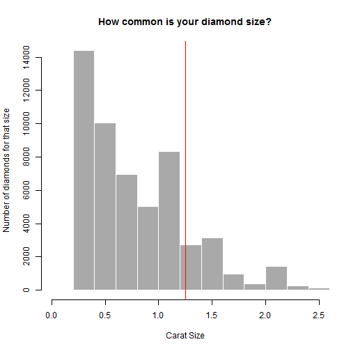

## Diamond Pricing application

Accessible via https://fat2301.shinyapps.io/shiny_project_diamond_price/  
Source code at https://github.com/fat2301/dataproducts.git  
  
___Description___ This application provides useful information about a diamond's 4C attributes. It allows the user to input the 4Cs of a diamond, and get basic information based on that input, including a reference price.  


--- .class #id 

## Key Features

1. Cross-references the diamond attributes in real-time to a statistical model generated from R's ggplot2 diamonds library to come up with a price reference. Updates as attributes are changed!
2. Provides educational information such as what clarity and colors mean. 
3. Really simple and easy to use.

--- 


## Key Features continued - Histogram comparison


```r
carat <- 1.25; #If carat slider is set to 1.25, it will overlay on histogram of diamond dataset.
```





--- 


## Acknowledgements and Disclaimers

Reference information about the 4Cs from:  
 http://www.4cs.gia.edu/en-us/the-diamond-4-cs.htm  
 
Disclaimer: This app is only intended to try out the Shiny feature of R for the Coursera course in Developing Data Products. Minimal effort was taken in building the pricing model and should not be taken seriously.  

